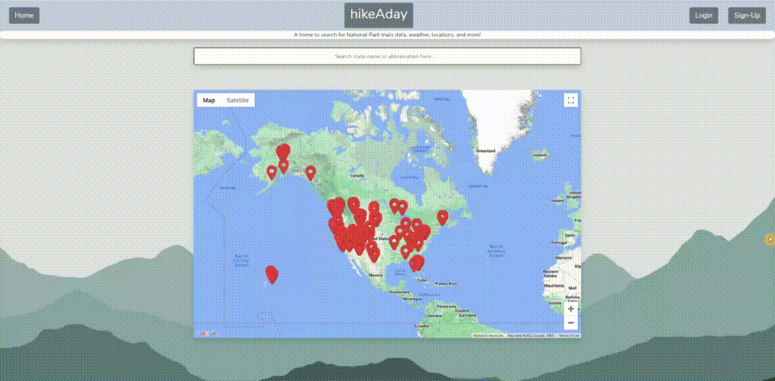
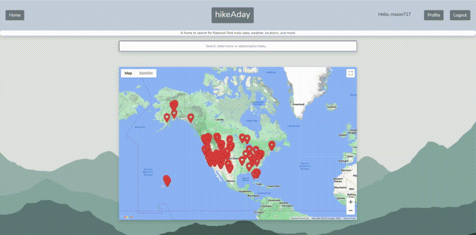
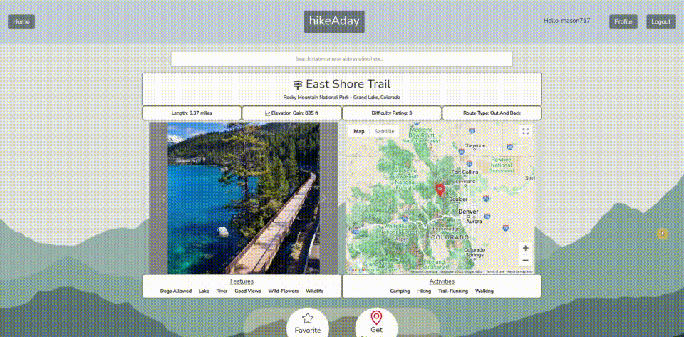
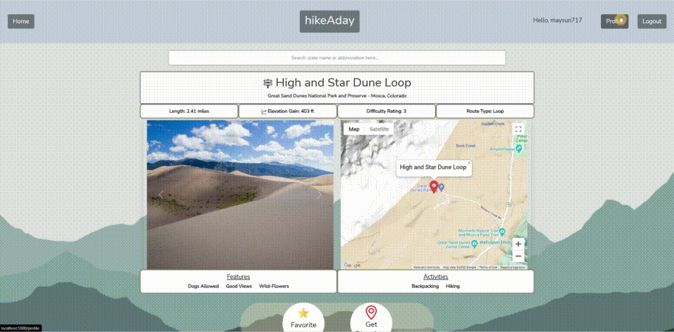

# hikeAday 
 
<br>
hikeAday is a full-stack web application where you can look up National Park trails information. You can see trail details, see the local weather forecast for a trail, keep track of your favorite trail, and review trails. <br>

💻 Deployment Link: https://hikeaday.app
<br>


## Contents 
* [Features](#features)
* [Technologies & Stack](#techstack)
* [Set-up & Installation](#installation)
* [About the Developer](#aboutme)

## <a name="features"></a>

User-friendly landing page
<br>
<br>

<br>

User registration, log-in, & log-out
<br>
<br>

<br>

Search for trails by state, or by selecting a map marker
<br>
<br>

<br/>

Learn about the trail's details, the local weather forecast, leave reviews, favorite trails, and more!
<br>
<br>

<br/>

Keep track of reviews and your favorite trails in the user Profile page
<br>
<br>

<br>


## <a name="techstack"></a> Technologies and Stack
**Backend:**
Python, Flask, SQLAlchemy, PostgreSQL, Jinja, Javascript(AJAX, JSON) <br>
**Frontend:**
Javascript, Bootstrap, Google Fonts, HTML5, CSS3 <br>
**APIs:**
Google Maps, Open Weather Map API, Bing Image Search


## <a name="installation"></a> Set-up & Installation
Install a code editor such as [VS code](https://code.visualstudio.com/download).<br>
Install [Python3](https://www.python.org/downloads/)<br>
Install [pip](https://pip.pypa.io/en/stable/installation/), the package installer for Python <br>
Install [postgreSQL](https://www.postgresql.org/) for the relational database.<br>


Clone or fork repository:
```
$ git clone https://github.com/mwilkins/hikeaday
```
Create and activate a virtual environment inside the hikeAday directory:
```
$ virtualenv env
$ source env/bin/activate
```
Install dependencies:
```
$ pip3 install -r requirements.txt
```
Make an account with [Google Developers](https://developers.google.com/maps/documentation) & get an [API key](https://console.cloud.google.com/google/maps-apis/start).<br>
Make an account with [Bing Search API](https://docs.microsoft.com/en-us/azure/cognitive-services/bing-web-search/) & get an [API key](https://aka.ms/bingapisignup).<br>
Make an account with [Open Weather Map API](https://openweathermap.org/api) & get an [API key](https://home.openweathermap.org/users/sign_up)

Store these keys in a file named 'secrets.sh' <br> 
```
$ source secrets.sh
```
With PostgreSQL, create the hikeAday database
```
$ createdb hikeaday
```
Create all tables and relations in the database and seed all data:
```
$ python3 -i crud.py
$ _populate_database()
```
Run the app from the command line:
```
$ python3 server.py
```


## <a name="aboutme"></a> About the Developer

hikeAday creator Mason Wilkins has worked in property management and the real estate industry as a realtor for most of his career. Mason has always had an interest in technology all of his life, and after trying many different career paths, he decided to puruse his love for technology by learning to program by attending a software engineering bootcamp with Hackbright Academy. Mason truly found his way as with this botocamp, he felt he was finally being challenged and his love for an ability to problem solve could be used. Mason is excited for the challanges he will get to overcome and the problems he will have the opportunity to solve after the program. This is her first full-stack project. Mason can be found on [LinkedIn](https://www.linkedin.com/in/mwilkins17/) and on [Github](https://github.com/mwilkins17).
